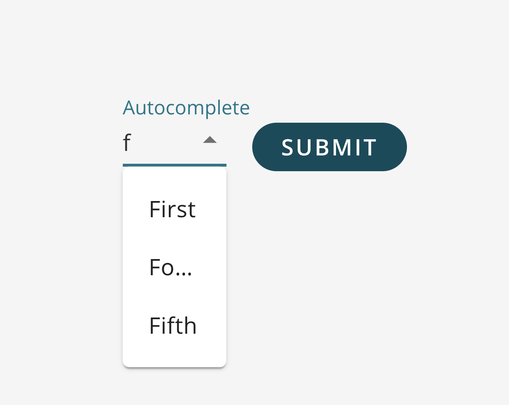

A dropdown menu that allows the user to filter available options. <br />



<br />

## How to Use

```js
import {SQForm, SQFormAutocomplete, SQFormOption} from '@selectquotelabs/sqform';
//dropdown menu options
const options:SQFormOption[] = [
    {label: 'First', value: 'first'},
    {label: 'Second', value:'second', isDisabled:true}
];
return (
  <SQForm initialValues={} onSubmit={noop}>
    <SQFormAutocomplete>{options}</SQFormAutocomplete>
  </SQForm>
);
```

## Props

`SQFormAutocompleteProps`

| Prop Name | Required | Type | Default | Description |
| --- | --- | --- | --- | --- |
| children | true | `SQFormOption[]` |  | Dropdown menu options to select from |
| isDisabled | false | boolean | false | Controls whether the input is disabled |
| displayHelperText | false | boolean | false | Whether or not todisplay the helper text |
| displayEmpty | false | boolean | false | Whether to display empty option |
| onBlur | false | function |  | Custom onBlur event callback |
| onChange | false | function |  | Callback function to be fired when button is clicked |
| onInputChange | false | function |  | Custom onInputChange event callback (key pressed) |
| lockWidthToField | false | boolean | false | Lock width of the dropdown to the width of the field in the form |
| muiTextFieldProps | false | `TextFieldProps` |  | Any valid prop for material ui text input child component - [TextField API](https://material-ui.com/api/text-field/#props) |
