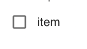
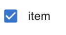

A checkbox field for SQForm. <br />

 

<br />

## How to Use

```js
import {SQForm, SQFormCheckbox } from '@selectquotelabs/sqform';
return (
  <SQForm initialValues={} onSubmit={noop}>
  {/* name and label are required fields from the base field props */}
    <SQFormCheckbox name='option' label='Option' />
  </SQForm>
);
```

## Props

`SQFormCheckboxProps`

| Prop Name | Required | Type | Default | Description |
| --- | --- | --- | --- | --- |
| isDisabled | false | boolean | false | Controls whether the input is disabled |
| onChange | false | function |  | Custom onChange event callback |
| muiFieldProps | false | `CheckboxProps` |  | Any valid prop for material ui checkbox child component - [Checkbox Props](https://material-ui.com/api/checkbox/#props) |
