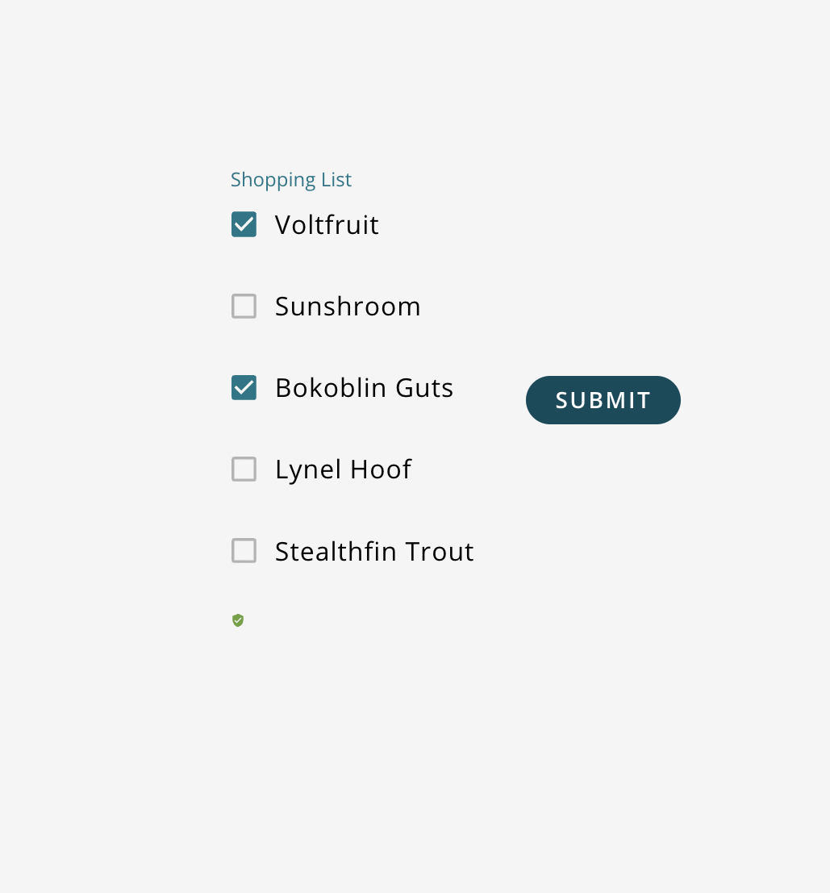

A field allowing a user to select multiple items from a list. Each list item is of type `SQFormCheckBoxGroupItem`. <br />

 <br />

## How to Use

```js
import {SQForm, SQFormCheckboxGroup } from '@selectquotelabs/sqform';
const options = [
    {value:'voltfruit', label:'Voltfruit'},
    {value:'sunshroom', label:'Sunshroom'},
    {value:'bokoblin nuts', label:'Bokoblin Nuts'},
    {value:'lynel hoof', label:'Lynel Hoof'},
    {value:'stealthfin trout', label:'Stealthfin Trout'}
];
return (
  <SQForm initialValues={} onSubmit={noop}>
    <SQFormCheckboxGroup name='shopping list' groupLabel='Shopping List'>
        {options}
    <SQFormCheckboxGroup />
  </SQForm>
);
```

## Props

`SQFormCheckboxGroupProps`

| Prop Name | Required | Type | Default | Description |
| --- | --- | --- | --- | --- |
| name | true | string |  | Name of the checkbox group |
| groupLabel | true | string |  | Label to display above the group |
| onChange | false | function |  | Custom onChange event callback |
| shouldDisplayInRow | false | boolean | false | Whether to display the group in a row |
| shouldUseSelectAll | false | boolean | false | Whether to display the select all checkbox |
| size | false | `GridSize` |  | Size of the input given full-width is 12. |
| children | true | `CheckboxOption[]` |  | an array of object with checkbox label and value information |
