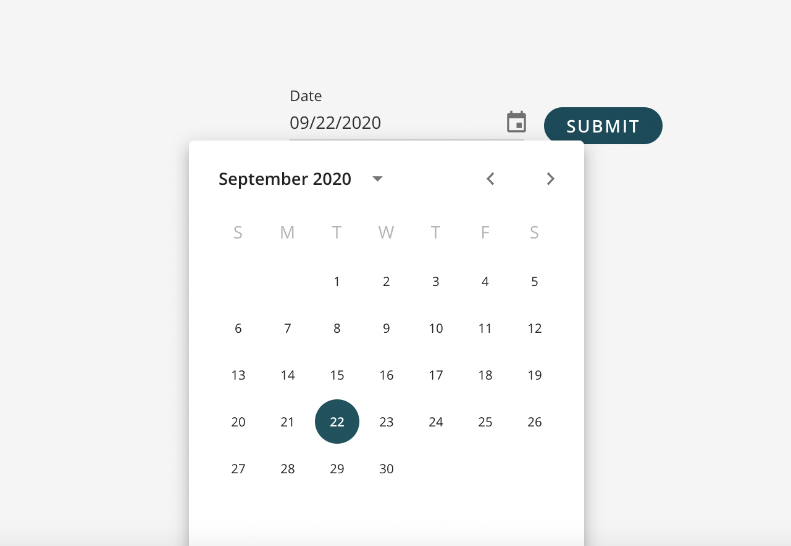

A field allowing a user to select a date from a calendar. <br />

 <br />

## How to Use

```js
import {SQForm, SQFormDatePicker } from '@selectquotelabs/sqform';
return (
  <SQForm initialValues={} onSubmit={noop}>
    {/* label is required via the base field props */}
    <SQFormDatePicker label='Date' />
  </SQForm>
);
```

## Props

`SQFormDatePickerProps`

| Prop Name | Required | Type | Default | Description |
| --- | --- | --- | --- | --- |
| displayHelperText | false | boolean | false | Whether or not to show the helper text |
| onBlur | false | function |  | Custom onBlur event callback |
| onChange | false | function |  | Custom onChange event callback |
| isDisabled | false | boolean | false | Disabled property to disable the input if true |
| placeHolder | false | string |  | Placeholder text used inside the input field to provide hints to the user |
| setDisabledDate | false | function |  | Disable specific date(s) (day: DateIOType) => boolean. This is a predicate function called for every day of the month. Return true to disable that day or false to enable that day |
| muiFieldProps | false | `MuiFieldProps<Moment>` |  | any valid prop for material ui datepicker child component - [MUI Picker Component](https://material-ui.com/components/pickers/) |
| muiTextInputProps | false | `InputBaseComponentProps` |  | Any valid prop for MUI input field - [TextField API](https://material-ui.com/api/text-field/) & [Input Attributes](https://developer.mozilla.org/en-US/docs/Web/HTML/Element/input#attributes) |
| InputProps | false | `DatePickerProps<Moment, Moment>['InputProps']` |  | Props provided to the Input component. Most commonly used for adornments. |
| InputAdornmentProps | false | `DatePickerProps<Moment,Moment>['InputAdornmentProps']` |  | Props provided to the input adornments. |
| isCalendarOnly | false | boolean | false | A Boolean flag used when using calendar only; disabled text filed input |
