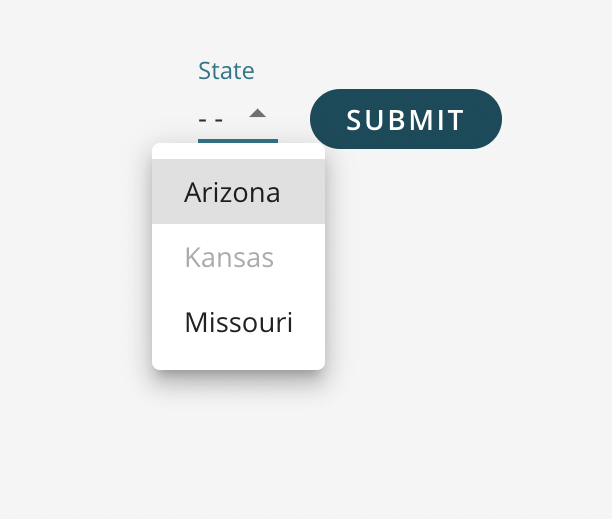

A field allowing a user to select from a predefined set of values. <br />

 <br />

## How to Use

```js
import {SQForm, SQFormDropdown } from '@selectquotelabs/sqform';
//options must contain value and label information.
const options = [
    {value:'az', label:'Arizona'},
    {value:'ks', label:'Kansas', isDisabled:true},
    {value:'mo', label:'Missouri'}
];
return (
  <SQForm initialValues={} onSubmit={noop}>
    <SQFormDropdown label='State'>
        {options}
    <SQFormDropdown />
  </SQForm>
);
```

## Props

`SQFormDropdownProps`

| Prop Name | Required | Type | Default | Description |
| --- | --- | --- | --- | --- |
| children | true | `SQFormOption[]` |  | Dropdown options to select from |
| displayHelperText | false | boolean | false | Whether or not to show the helper text |
| onBlur | false | function |  | Custom onBlur event callback |
| onChange | false | function |  | Custom onChange event callback |
| isDisabled | false | boolean | false | Disabled property to disable the input if true |
| displayEmpty | false | boolean | false | Whether to display empty option - - in options |
| muiFieldProps | false | `SelectProps` |  | Size of the input given full-width is 12. |
