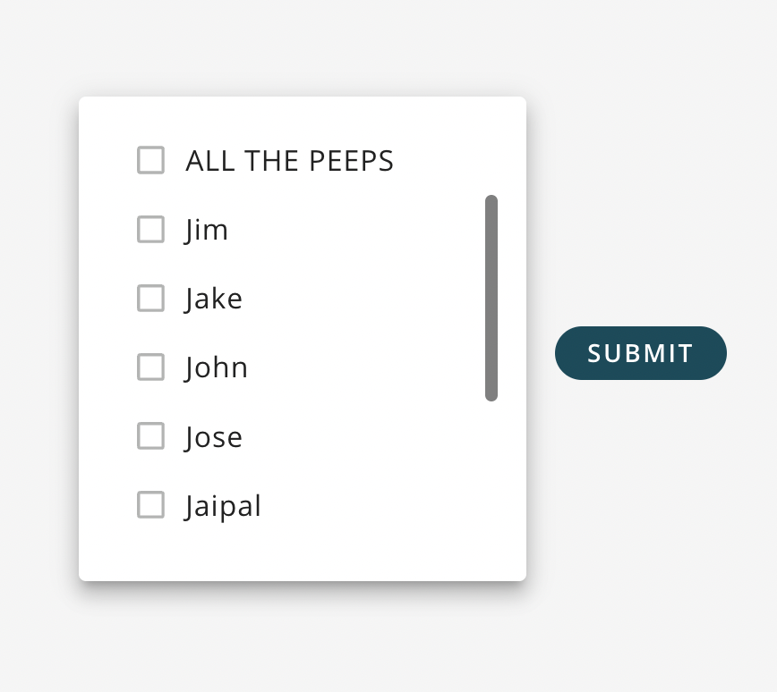
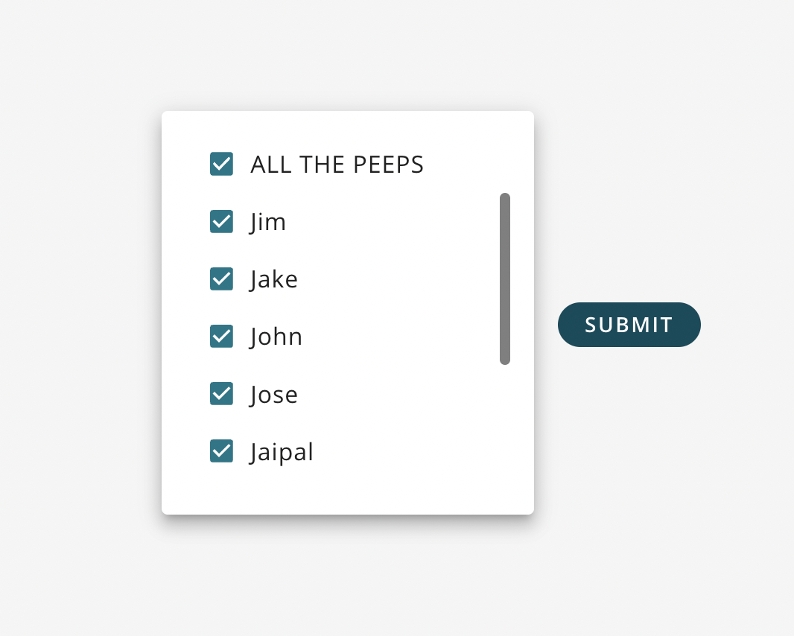

A field allowing a user to select multiple values to include. <br />

  <br />

## How to Use

```js
import {
  SQForm,
  SQFormInclusionList
} from '@selectquotelabs/sqform';
const initialValues={{
    friends: ['Joe', 'Jane', 'Jack', 'Jill'],
    selectAll: false,
}}
return (
    <SQForm initialValues={initialValues} onSubmit={noop}>
      <SQFormInclusionList
        name="friends"
        selectAllContainerProps={{
          style: {
            padding: '0 16px',
          },
        }}
        selectAllData={[
          'Jim',
          'Jake',
          'John',
          'Jose',
          'Jaipal',
          'Joe',
          'Jane',
          'Jack',
          'Jill',
        ]}
        selectAllProps={{
          label: 'ALL THE PEEPS',
        }}
        useSelectAll
      />
    </SQForm>
);
```

## Props

`SQFormInclusionListProps`

| Prop Name | Required | Type | Default | Description |
| --- | --- | --- | --- | --- |
| name | true | string |  | The `name` must match the name of the desired array in `initialValues` |
| children | true | function |  | Children must be a function that accepts one param of type FieldArrayRenderProps and returns a single, or array of, SQFormInclusionListItems |
| useSelectAll | false | boolean | false | boolean flag to trigger usage of Select All functionality text |
| selectAllData | false | `SQFormOption['value'][]` |  | array of items to put in the `name` array on 'select all' clickcallback |
| selectAllContainerProps | false | `GridProps` |  | props for the Grid container wrapping the select all checkbox |
| selectAllProps | false | `SQFormInclusionListItemProps` |  | props for the 'select all' SQFormInclusionListItem component |
