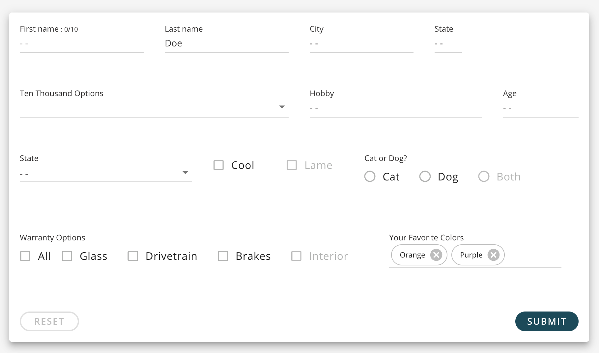

# SQForm

The main form component.



<br />

## How to Use

```js
import {SQForm, SQFormDropdown} from '@selectquotelabs/sqform';
return (
  <SQForm initialValues={{recording: ''}} onSubmit={noop}>
    <SQFormDropdown
      label="Recording"
      name="recording"
      onChange={handleRecordingChange}
      size={12}
    >
      {playlistOptions}
    </SQFormDropdown>
  </SQForm>
);
```

See [Storybook](https://master--5f4431386ea00a00220d495c.chromatic.com/?path=/story/forms-sqform--basic-form) for more examples

<br />

## Props

Takes a Generic type for the values

`SQFormProps<Values extends FormikValues>`

| Prop Name          | Required | Type      | Default | Description                                                                            |
| ------------------ | -------- | --------- | ------- | -------------------------------------------------------------------------------------- |
| children           | true     | ReactNode |         | All the fields and other UI elements that are part of the form                         |
| initialValues      | true     | Values    |         | Base / starting values for the form object that determines if a field has been updated |
| onSubmit           | true     | function  |         | The callback function that runs when you submit the form                               |
| enableReinitialize | false    | boolean   | false   | Control whether Formik should reset the form if initialValues changes                  |
| muiGridProps       | false    | object    | {}      | Props that will be pass on to the internal Grid                                        |
| validationSchema   | false    | object    |         | Yup validation schema shape                                                            |
| validateOnBlur     | false    | boolean   | true    | Should validation occur onBlur                                                         |
| validateOnChange   | false    | boolean   | true    | Should validation occur onChange                                                       |
