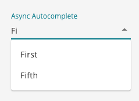

# SQFormAsyncAutocomplete

A dropdown field that can handle a large option data set. Allows user to start typing in value to filter down options.



## How to Use

```js
import {SQForm, SQFormAsyncAutocomplete} from '@selectquotelabs/sqform';
const initialValues = {
    example: ''
}
const options = [
  {
    label: 'First',
    value: 'first',
  },
  {
    label: 'Second',
    value: 'second',
  },
];
const handleSubmit = () => {
    // save data
}
return (
  <SQForm initialValues={initialValues} onSubmit={}>
    <SQFormAsyncAutocomplete name="example" label="Example">
      {options}
    </SQFormAsyncAutocomplete>
  </SQForm>
);
```

<br/>

## Props

All the props from `SQFormAutocomplete` plus the following:

| Prop Name              | Required | Type     | Default | Description                                                        |
| ---------------------- | -------- | -------- | ------- | ------------------------------------------------------------------ |
| handleAsyncInputChange | true     | function |         | Updates local state value for input then passed to a useQuery hook |
| loading                | false    | boolean  | false   | Whether the component is loading                                   |
| open                   | false    | boolean  |         | Whether the popup is open                                          |
| onOpen                 | false    | function |         | Callback when the popup requests to open                           |
| onClose                | false    | function |         | Callback when the popup requests to close                          |
